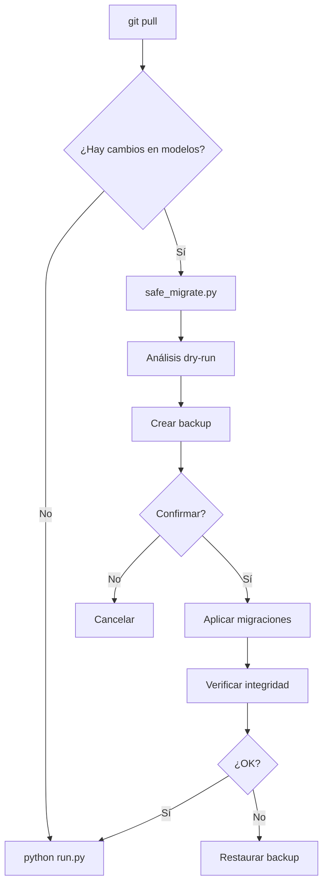

# 📚 Sistema de Migraciones de Base de Datos

Sistema completo para actualizar el esquema de la base de datos sin perder datos existentes.

## 🎯 Scripts Disponibles

### 1. `safe_migrate.py` - Script Todo-en-Uno (RECOMENDADO)
Script automático que hace todo el proceso de forma segura.

**Uso:**
```bash
python scripts/safe_migrate.py
```

**¿Qué hace?**
- ✅ Analiza cambios pendientes
- ✅ Crea backup automático
- ✅ Pide confirmación
- ✅ Aplica migraciones
- ✅ Verifica integridad

---

### 2. `migrate_schema.py` - Migración Inteligente
Compara el esquema actual con los modelos SQLAlchemy y aplica diferencias.

**Uso:**
```bash
# Ver cambios sin aplicar
python scripts/migrate_schema.py --dry-run

# Aplicar con confirmación
python scripts/migrate_schema.py

# Aplicar sin confirmación
python scripts/migrate_schema.py --force
```

**Características:**
- Detecta tablas y columnas faltantes
- Genera ALTER TABLE automáticamente
- Aplica migraciones SQL de `/migrations`
- Registra cambios en `schema_migrations`

---

### 3. `backup_db.py` - Backups de SQLite
Crea copias de seguridad de la base de datos.

**Uso:**
```bash
# Crear backup con timestamp
python scripts/backup_db.py

# Listar backups existentes
python scripts/backup_db.py --list
```

---

## 🚀 Inicio Rápido

### Después de git pull

```bash
cd backend
python scripts/safe_migrate.py
```

### Si quieres control manual

```bash
# 1. Ver qué cambios hay
python scripts/migrate_schema.py --dry-run

# 2. Crear backup
python scripts/backup_db.py

# 3. Aplicar cambios
python scripts/migrate_schema.py
```

---

## 📊 Flujo de Trabajo



---

## 🔍 Comandos Útiles

### Ver historial de migraciones
```sql
SELECT * FROM schema_migrations ORDER BY applied_at DESC;
```

### Restaurar backup
```bash
# Listar
python scripts/backup_db.py --list

# Restaurar (reemplazar actual)
cp data/piar_backup_20260329_143025.db data/piar.db
```

---

## 💡 Buenas Prácticas

1. **Siempre usa `--dry-run` primero** en producción
2. **Haz backup manual adicional** en cambios críticos
3. **Lee los mensajes** que muestran los scripts
4. **En desarrollo** puedes usar `--force` para ir más rápido
5. **Guarda backups importantes** en otro directorio

---

## 📝 Archivos Creados

```
backend/scripts/
├── safe_migrate.py         # ⭐ Script todo-en-uno
├── safe_migrate.bat        # Wrapper para Windows
├── migrate_schema.py       # Migración inteligente
├── migrate_schema.bat      # Wrapper para Windows
├── migrate_schema.sh       # Wrapper para Linux/Mac
├── backup_db.py            # Sistema de backups
├── DB_QUICK_GUIDE.md       # 📖 Guía rápida
└── MIGRATION_SYSTEM.md     # 📚 Esta documentación
```

---

## 🆘 Solución de Problemas

### Error: "no such column: X"
```bash
python scripts/safe_migrate.py
```

### Error en migración
```bash
# Restaurar último backup
python scripts/backup_db.py --list
cp data/piar_backup_XXXXXX.db data/piar.db
```

### Empezar de cero (⚠️ PIERDE DATOS)
```bash
python scripts/reset_database.py recrear
```

---

## 📖 Documentación Completa

- [Guía Rápida](DB_QUICK_GUIDE.md) - Inicio rápido y casos comunes
- [README](README.md) - Documentación detallada de todos los scripts
- [Modelos](../app/models/) - Definición de esquemas SQLAlchemy

---

## 🔧 Extensión del Sistema

### Agregar nueva migración SQL manual

1. Crear archivo en `backend/migrations/`:
   ```bash
   touch migrations/2026_03_29_add_campo_nuevo.sql
   ```

2. Escribir SQL:
   ```sql
   ALTER TABLE usuarios ADD COLUMN campo_nuevo TEXT DEFAULT 'valor';
   ```

3. Ejecutar:
   ```bash
   python scripts/migrate_schema.py
   ```
   
El sistema detectará y aplicará automáticamente el nuevo archivo SQL.

---

## 🎓 Ejemplos de Uso

### Desarrollo diario
```bash
git pull
python scripts/safe_migrate.py --force
python run.py
```

### Antes de commit con cambios en modelos
```bash
python scripts/migrate_schema.py --dry-run
# Verificar que los cambios son los esperados
git add .
git commit -m "feat: agregar campo X a modelo Y"
```

### Producción
```bash
# Backup manual adicional
python scripts/backup_db.py --output backup_pre_deploy.db

# Actualizar
git pull
python scripts/safe_migrate.py

# Verificar
python run.py &
curl http://localhost:8000/health
```

---

**✅ Sistema listo para usar!**

Para empezar: `python scripts/safe_migrate.py`
